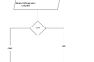

# Sistema de Gestão Escolar - EducaSys

**Disciplina:** Análise de Sistemas  
**Curso:** Técnico em Desenvolvimento de Sistemas  
**Equipe:** Arthur Dezanet,Antonia e Vitor Henrique
**Data:** 02/07/2026

---

##  Índice

1. [Nome do Sistema](#1-nome-do-sistema)
2. [Descrição do Problema](#2-descrição-do-problema)
3. [Objetivo do Sistema](#3-objetivo-do-sistema)
4. [Público-alvo](#4-público-alvo)
5. [Tipo de Sistema de Informação](#5-tipo-de-sistema-de-informação)
6. [Técnicas de Levantamento](#6-técnicas-de-levantamento)
7. [Requisitos Funcionais (RF)](#7-requisitos-funcionais-rf)
8. [Requisitos Não Funcionais (RNF)](#8-requisitos-não-funcionais-rnf)
9. [Regras de Negócio (RN)](#9-regras-de-negócio-rn)
10. [Escopo, Premissas e Restrições](#10-escopo-premissas-e-restrições)
11. [Matriz de Rastreabilidade](#11-matriz-de-rastreabilidade)
12. [Diagrama de Casos de Uso](#12-diagrama-de-casos-de-uso)
13. [Diagrama de Classes](#13-diagrama-de-classes)
14. [Diagrama de Sequência](#14-diagrama-de-sequência)
15. [Apresentação Final](#15-apresentação-final)

---

## 1. Nome do Sistema

**EducaSys** - Sistema Integrado de Gestão Escolar

---

## 2. Descrição do Problema

Atualmente, muitas escolas de ensino fundamental e médio enfrentam sérios desafios de gestão administrativa e acadêmica:

- **Registro manual de notas e faltas:** Professores utilizam planilhas ou cadernos, o que gera erros e perda de informações.
- **Dificuldade de comunicação com os pais:** Muitas escolas ainda utilizam bilhetes em papel ou WhatsApp não estruturado.
- **Controle financeiro ineficiente:** Mensalidades controladas em planilhas, com alto índice de inadimplência.
- **Falta de relatórios gerenciais:** Diretores não têm dados consolidados para tomada de decisão.
- **Processo de matrícula manual:** Papelada extensa, perda de documentos e retrabalho.
- **Dificuldade no controle de biblioteca:** Livros emprestados sem registro adequado.

---

## 3. Objetivo do Sistema

Desenvolver um sistema web completo para automatizar e centralizar a gestão educacional, proporcionando:

- Gestão acadêmica integrada (notas, frequência, boletins)
- Comunicação eficiente entre escola, professores e pais
- Controle financeiro (mensalidades, inadimplência)
- Processo de matrícula digital
- Biblioteca escolar com controle de empréstimos
- Relatórios gerenciais
- Portal do aluno com acesso a notas, horários e comunicados

---

## 4. Público-alvo

| Perfil | Descrição |
|--------|-----------|
| **Diretores e Coordenadores** | Visão estratégica e gestão geral da escola |
| **Professores** | Lançamento de notas, faltas e atividades |
| **Secretários** | Matrículas, documentos e atendimento |
| **Pais/Responsáveis** | Acompanhamento dos filhos |
| **Alunos** | Consulta de notas, horários e comunicados |
| **Funcionários da Biblioteca** | Controle de empréstimos e acervo |

---

## 5. Tipo de Sistema de Informação

**Sistema B2C (Business to Consumer)** com características de **ERP Educacional**, integrando:

- Módulo Acadêmico (notas, faltas, boletins)
- Módulo Financeiro (mensalidades, cobranças)
- Módulo de Biblioteca
- Módulo de Comunicação

---

## 6. Técnica de Levantamento


###  Análise de Documentos
- Diário de classe (físico)
- Planilha de controle de notas (Excel)
- Ficha de matrícula (papel)
- Modelo de boletim escolar
- Controle de biblioteca (caderno)

---

## 7. Requisitos Funcionais (RF)

### Módulo Acadêmico

| Código | Requisito | Prioridade |
|--------|-----------|------------|
| RF-01 | Cadastrar, editar e excluir alunos | Alta |
| RF-02 | Cadastrar, editar e excluir professores | Alta |
| RF-03 | Cadastrar, editar e excluir turmas | Alta |
| RF-04 | Lançar notas por disciplina e bimestre | Alta |
| RF-05 | Lançar frequência (presença/falta) por aula | Alta |
| RF-06 | Gerar boletim individual automaticamente | Alta |
| RF-07 | Calcular média final e aprovação/reprovação | Alta |
| RF-08 | Gerar relatório de rendimento por turma | Média |

### Módulo Financeiro

| Código | Requisito | Prioridade |
|--------|-----------|------------|
| RF-09 | Cadastrar mensalidades e valores por série | Alta |
| RF-10 | Registrar pagamentos e gerar recibos | Alta |
| RF-11 | Gerar lista de inadimplentes | Média |
| RF-12 | Emitir boletos bancários | Baixa |
| RF-13 | Gerar relatório de fluxo de caixa mensal | Média |

### Módulo de Comunicação

| Código | Requisito | Prioridade |
|--------|-----------|------------|
| RF-14 | Enviar notificações para pais (email/WhatsApp) | Média |
| RF-15 | Publicar comunicados gerais | Média |
| RF-16 | Mural de avisos para alunos | Baixa |

### Módulo de Matrícula

| Código | Requisito | Prioridade |
|--------|-----------|------------|
| RF-17 | Realizar matrícula digital com upload de documentos | Alta |
| RF-18 | Renovar matrícula automaticamente | Média |
| RF-19 | Histórico completo do aluno | Alta |

### Módulo de Biblioteca

| Código | Requisito | Prioridade |
|--------|-----------|------------|
| RF-20 | Cadastrar livros (título, autor, ISBN, quantidade) | Média |
| RF-21 | Registrar empréstimos e devoluções | Média |
| RF-22 | Controlar reservas de livros | Baixa |

### Módulo Administrativo

| Código | Requisito | Prioridade |
|--------|-----------|------------|
| RF-23 | Gerenciar usuários e permissões de acesso | Alta |
| RF-24 | Gerar relatório de evasão escolar | Média |
| RF-25 | Gerar estatísticas (média geral, aprovação por turma) | Média |

---

## 8. Requisitos Não Funcionais (RNF)

| Código | Categoria | Descrição |
|--------|-----------|-----------|
| RNF-01 | Disponibilidade | Sistema disponível 99,5% do tempo |
| RNF-02 | Desempenho | Carregar qualquer tela em até 3 segundos |
| RNF-03 | Segurança | Senhas criptografadas (bcrypt) |
| RNF-04 | Segurança | Bloquear acesso após 5 tentativas de login |
| RNF-05 | Controle de Acesso | Níveis: admin, diretor, coordenador, professor, secretário, pai, aluno |
| RNF-06 | Usabilidade | Interface simples, organizada e fácil |
| RNF-07 | Compatibilidade | Funcionar em Chrome, Firefox, Edge e Safari |
| RNF-08 | Idioma | Interface em Português |
| RNF-09 | Confiabilidade | Backup automático diário |
| RNF-10 | Auditabilidade | Log de todas as ações dos usuários |
| RNF-11 | Portabilidade | Acessível em computadores, tablets e smartphones |
| RNF-12 | Manutenibilidade | Código documentado seguindo MVC |
| RNF-13 | Escalabilidade | Suportar até 10.000 usuários simultâneos |
| RNF-14 | Legal | Conformidade com LGPD |

---

9. Regras de Negócio (RN)

| Código | Regra de Negócio | Descrição | RF Relacionado |
|--------|------------------|-----------|----------------|
| RN-01 | Média para aprovação | Média mínima 7,0 com presença mínima de 75% | RF-04, RF-07 |
| RN-02 | Recuperação | Aluno com média entre 4,0 e 6,9 tem direito à recuperação | RF-07 |
| RN-03 | Reprovação automática | Frequência inferior a 75% = reprovação automática | RF-05, RF-07 |
| RN-04 | Cálculo de média | Média final = (Média Bimestral × 0,6) + (Prova Final × 0,4) | RF-07 |
| RN-05 | Desconto em mensalidade | 10% desconto pagamento até dia 10 (2º filho: 15%, 3º: 20%) | RF-09 |
| RN-06 | Inadimplência | Mensalidade com atraso > 30 dias = aluno bloqueado | RF-10, RF-11 |
| RN-07 | Matrícula | Matrícula válida por 1 ano letivo | RF-17 |
| RN-08 | Empréstimo de livros | Prazo máximo: 7 dias (renovável por mais 7 dias) | RF-21 |
| RN-09 | Limite de livros | Aluno pode emprestar no máximo 3 livros | RF-21 |
| RN-10 | Multa biblioteca | Multa de R$ 2,00 por dia de atraso | RF-21 |
| RN-11 | Notificação de falta | Aviso automático quando aluno acumular 5 faltas | RF-05, RF-14 |
| RN-12 | Prova final | Somente alunos com média ≥ 4,0 podem fazer prova final | RF-07 |
| RN-13 | Trancamento | Aluno só pode trancar até 30 dias após início do bimestre | RF-17 |
| RN-14 | Transferência | Histórico escolar completo obrigatório | RF-19 |
| RN-15 | Cadastro único | Não permitir dois alunos com o mesmo CPF | RF-01 |
| RN-16 | Professor vinculado | Professor com disciplinas não pode ser excluído | RF-02 |

---

## 10. Escopo, Premissas e Restrições

Escopo (Dentro do Projeto)
- Gestão acadêmica completa (alunos, professores, turmas, notas, faltas)
- Módulo financeiro básico (mensalidades, pagamentos, inadimplência)
- Portal do aluno e dos pais
- Sistema de biblioteca
- Comunicação interna
- Relatórios gerenciais

Fora do Escopo
- Módulo completo de RH (folha de pagamento, benefícios)
- Integração com sistema governamental (Censo Escolar)
- Aplicativo mobile nativo (apenas versão web responsiva)
- Sistema de merenda escolar
- Sistema de transporte escolar
- Integração com gateways de pagamento (fase 2)

Premissas
- Escola possui infraestrutura de internet e computadores
- Professores e funcionários têm conhecimento básico de informática
- Pais têm acesso a smartphone com internet
- Dados hospedados em nuvem
- Backups automáticos

 Restrições
- Orçamento: R$ 25.000,00
- Prazo: 5 meses (agosto a dezembro/2026)
- Equipe: 5 desenvolvedores
- Tecnologia: Node.js + React + PostgreSQL
- Deve estar pronto em janeiro/2027

---

## 11. Matriz de Rastreabilidade

| Requisito | Origem | Fonte |
|-----------|--------|-------|
| RF-01, RF-02, RF-03 | Cadastro de alunos, professores, turmas | Entrevista + Documentos |
| RF-04, RF-05 | Lançar notas e frequência | Observação + Documentos |
| RF-06, RF-07 | Gerar boletim e calcular média | Entrevista + Documentos |
| RF-08 | Relatório por turma | Questionário |
| RF-09, RF-10, RF-11 | Controle financeiro | Entrevista + Observação |
| RF-12, RF-13 | Boletos e relatório de fluxo de caixa | Questionário + Entrevista |
| RF-14, RF-15, RF-16 | Comunicação | Entrevista + Observação |
| RF-17, RF-18, RF-19 | Matrícula | Documentos + Observação |
| RF-20, RF-21, RF-22 | Biblioteca | Observação |
| RF-23, RF-24, RF-25 | Administração | Entrevista + Questionário |
| RN-01 a RN-16 | Regras de negócio | Entrevista + Documentos |

---

## 12. Diagrama de Casos de Uso

### Atores Identificados:

| Ator | Tipo | Descrição |
|------|------|-----------|
| **Diretor** | Primário | Gestão geral e relatórios estratégicos |
| **Coordenador** | Primário | Acompanhamento pedagógico |
| **Professor** | Primário | Lançamento de notas, faltas e atividades |
| **Secretário** | Primário | Matrículas, documentos e cadastros |
| **Pai/Responsável** | Primário | Acompanhamento dos filhos |
| **Aluno** | Primário | Consulta de notas, horários e comunicados |
| **Bibliotecário** | Primário | Controle de empréstimos e acervo |
| **Sistema** | Secundário | Envio de notificações automáticas |

### Casos de Uso Principais:
1. Gerenciar Alunos
2. Gerenciar Professores
3. Gerenciar Turmas
4. Lançar Notas
5. Lançar Frequência
6. Gerar Boletim
7. Calcular Média Final
8. Gerenciar Mensalidades
9. Registrar Pagamentos
10. Gerenciar Inadimplência
11. Enviar Notificações
12. Realizar Matrícula
13. Gerenciar Biblioteca
14. Gerar Relatórios
15. Gerenciar Usuários
16. Autenticar Usuário




---

## 13. Diagrama de Classes

### Classes Principais do Sistema:

```mermaid
classDiagram
    class Usuario {
        +int id
        +string nome
        +string email
        +string senha
        +enum perfil
        +date data_cadastro
        +login()
        +logout()
        +atualizarPerfil()
    }

    class Aluno {
        +string matricula
        +date data_nascimento
        +string responsavel
        +string telefone_responsavel
        +calcularMedia()
        +verificarFrequencia()
        +gerarHistorico()
    }

    class Professor {
        +string formacao
        +array especialidades
        +float valor_hora_aula
        +lancarNotas()
        +lancarFrequencia()
        +gerarRelatorioTurma()
    }

    class Turma {
        +int id
        +string nome
        +string serie
        +int ano_letivo
        +Professor professor
        +adicionarAluno()
        +removerAluno()
        +calcularMediaTurma()
    }

    class Disciplina {
        +int id
        +string nome
        +int carga_horaria
        +associarProfessor()
    }

    class Nota {
        +int id
        +Aluno aluno
        +Disciplina disciplina
        +int bimestre
        +float nota
        +validarNota()
    }

    class Frequencia {
        +int id
        +Aluno aluno
        +Disciplina disciplina
        +date data
        +boolean presente
        +calcularPresenca()
    }

    class Boletim {
        +int id
        +Aluno aluno
        +int bimestre
        +array notas
        +float media_final
        +string situacao
        +gerarPDF()
    }

    class Mensalidade {
        +int id
        +Aluno aluno
        +date mes
        +float valor
        +enum status
        +date data_vencimento
        +calcularMulta()
        +gerarBoleto()
    }

    class Pagamento {
        +int id
        +Mensalidade mensalidade
        +float valor_pago
        +date data_pagamento
        +enum forma_pagamento
        +emitirRecibo()
    }

    class Livro {
        +int id
        +string titulo
        +string autor
        +string editora
        +string isbn
        +int quantidade
        +int disponiveis
        +reservar()
        +emprestar()
        +devolver()
    }

    class EmprestimoLivro {
        +int id
        +Livro livro
        +Aluno aluno
        +date data_emprestimo
        +date data_devolucao_prevista
        +date data_devolucao_real
        +enum status
        +calcularMulta()
    }

    class Matricula {
        +int id
        +Aluno aluno
        +Turma turma
        +date data_matricula
        +int ano_letivo
        +enum status
        +renovar()
        +trancar()
        +transferir()
    }

    class Comunicado {
        +int id
        +string titulo
        +text conteudo
        +date data_publicacao
        +Usuario autor
        +enum nivel_acesso
        +enviarNotificacao()
    }

    Usuario <|-- Aluno
    Usuario <|-- Professor
    Turma "1" -- "*" Aluno
    Turma "1" -- "1" Professor
    Turma "1" -- "*" Disciplina
    Aluno "1" -- "*" Nota
    Aluno "1" -- "*" Frequencia
    Aluno "1" -- "1" Boletim
    Aluno "1" -- "*" Mensalidade
    Mensalidade "1" -- "*" Pagamento
    Aluno "1" -- "*" EmprestimoLivro
    Livro "1" -- "*" EmprestimoLivro
    Aluno "1" -- "*" Matricula
    Turma "1" -- "*" Matricula
    Usuario "1" -- "*" Comunicado
    
    